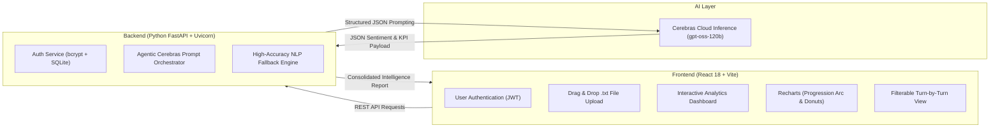

# 🎙️ Sentiment Analyzer & Call Intelligence Platform

[](https://reactjs.org/)
[](https://fastapi.tiangolo.com/)
[](https://cerebras.ai/)
[](https://tailwindcss.com/)
[](https://sqlite.org/)

An enterprise-grade, full-stack **Sentiment Analysis & Call Center Intelligence System** designed to evaluate customer service conversations, detect emotional arcs, calculate vital call center KPIs (CSAT, Empathy, Resolution, Escalation Risk), and provide sentence-by-sentence analytical breakdowns powered by **Cerebras AI (`gpt-oss-120b`)**.

---

## 🏗️ Architecture & Data Flow



---

## ✨ Key Features

### 1. 🔐 Clean User Authentication
- Embedded **SQLite database** (`sentiment_app.db`, `users` table).
- Industry-standard password hashing using `bcrypt` and token verification with `pyjwt`.
- User Registration and Sign In flows with automatic session persistence.

### 2. 📂 Seamless Conversation Upload
- Drag-and-drop support for `.txt` phone conversation transcripts.
- Integrated plain-text editor with live line and word counters.

### 3. 📊 Call Center KPI Intelligence
- **Overall Sentiment**: Categorized into *Positive*, *Negative*, or *Neutral* with confidence percentages and reasoning.
- **Call Summary KPI**: Complete, unclipped executive summary detailing caller concerns, agent responses, and final outcomes.
- **Speakers Involved & Talk Share**: Exact count of participants (e.g., 2 Persons) with turn counts and talk percentage breakdown.
- **Customer Satisfaction (CSAT)**: 1.0 to 5.0 rating scale computed from dialogue polarity.
- **Resolution Status**: Categorized as *Resolved*, *Partially Resolved*, or *Escalated*.
- **Escalation Risk**: Automated risk assessment (*Low*, *Medium*, *High*).
- **Agent Empathy Score**: Evaluates agent professionalism, patience, and de-escalation effectiveness.

### 4. 📈 Interactive Visual Charts
- **Sentiment Progression Arc**: Prominent line/area chart tracking emotional shifts turn-by-turn with clear axes:
  - **X-Axis**: Dialogue Turn Number (Conversation sequence).
  - **Y-Axis**: Sentiment Polarity Level (`Positive (+1)`, `Neutral (0)`, `Negative (-1)`).
- **Sentiment Distribution**: Donut breakdown of overall polarity share.
- **Emotion Detection**: Frequency analysis across primary emotions (*Joy*, *Satisfaction*, *Frustration*, *Relief*, *Confusion*, *Anger*).
- **Customer vs. Agent Comparison**: Polarity breakdown categorized by speaker role.

### 5. 🔍 Turn-by-Turn Sentence Analysis
- Searchable and filterable chat view (filter by *Speaker* or *Sentiment*).
- Individual sentiment badge, emotion tag, and expandable AI reasoning for every line.

### 6. 📄 Report Export
- 1-click export of complete analysis to formatted **Text (.txt)** or raw **JSON**.

---

## 🛠️ Tech Stack

| Layer | Technology | Purpose |
| :--- | :--- | :--- |
| **Frontend** | React 18, Vite, Tailwind CSS | UI, routing, and responsive dashboard layout |
| **Data Viz** | Recharts, Lucide React | Visual charts and modern UI iconography |
| **Backend** | Python 3.14, FastAPI, Uvicorn | High-performance asynchronous REST API server |
| **Database** | SQLite, bcrypt, PyJWT | Embedded user authentication and token handling |
| **AI Model** | Cerebras `gpt-oss-120b` | High-throughput LLM sentiment and KPI extraction |

---

## 🚀 Getting Started

### Prerequisites
- **Python** (v3.10+)
- **Node.js** (v18+) & **npm**

---

### Step-by-Step Local Setup

#### 1. Clone the Repository
```bash
git clone https://github.com/manishankar2505/sentimentanalyzer.git
cd sentimentanalyzer
```

#### 2. Start Backend (FastAPI + Uvicorn)
```bash
cd backend
python -m pip install -r requirements.txt
python -m uvicorn main:app --reload --port 5000
```
> Backend will be running at `http://localhost:5000`  
> Interactive API Docs (Swagger): `http://localhost:5000/docs`

#### 3. Start Frontend (React + Vite)
In a new terminal window:
```bash
cd frontend
npm install
npm run dev
```
> Frontend will be running at `http://localhost:3000`

---

## 📂 Repository Structure

```
sentimentanalyzer/
├── backend/
│   ├── main.py                 # FastAPI endpoints & routing
│   ├── database.py             # SQLite database operations & auth
│   ├── cerebras_client.py      # Cerebras LLM orchestration
│   ├── fallback_analyzer.py    # Fallback NLP analysis engine
│   ├── requirements.txt        # Python dependencies
│   ├── .env                    # Configuration & API keys
│   └── sentiment_app.db        # SQLite database
├── frontend/
│   ├── src/
│   │   ├── components/         # Dashboard, Charts, KPI cards, Sentence view, Login
│   │   ├── services/           # Axios REST API client
│   │   ├── App.jsx             # React master component
│   │   ├── main.jsx            # DOM entry
│   │   └── index.css           # Tailwind styles
│   ├── index.html
│   ├── vite.config.js
│   ├── tailwind.config.js
│   └── package.json
├── sample_transcripts/         # Pre-packaged .txt transcripts for instant testing
│   ├── call_sample_1_billing_frustration.txt
│   ├── call_sample_2_tech_support_success.txt
│   ├── call_sample_3_mixed_escalation.txt
│   └── call_sample_4_inquiry_neutral.txt
├── .vscode/                    # VS Code task configs
├── start.bat                   # 1-Click launcher
└── README.md
```

---

## 📝 License
MIT License. Built for the Sentiment Analyzer Assignment.
