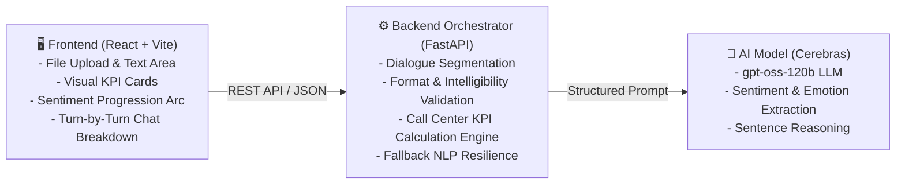

# 🎙️ Sentiment Analyzer
> **Conversation Text Analyzer and Sentiment Detector**

[](https://reactjs.org/)
[](https://fastapi.tiangolo.com/)
[](https://cerebras.ai/)
[](https://tailwindcss.com/)
[](https://sqlite.org/)

An enterprise-ready **Conversation Intelligence & Sentiment Analysis Platform** built to analyze customer service phone calls, detect turn-by-turn emotional trajectories, calculate vital call center KPIs, and provide sentence-level reasoning powered by **Python FastAPI** and **Cerebras AI (`gpt-oss-120b`)**.

---

## 🏗️ Simple Architecture



---

## 📋 What is Done

### 1. 📂 Ingestion & Strict Format Validation
- Accepts **`.txt` transcript file uploads** or **direct copy-pasted conversation text**.
- **Smart Dialogue Turn Extraction**: Automatically detects and separates turns for single or multi-speaker conference calls (e.g. `Agent (Alex): ...`, `Customer 1 (Jane): ...`, `Customer 2 (Tom): ...`).
- **Format & Gibberish Guardrails**: Detects and rejects non-dialogue inputs (e.g., essays, news articles, single monologues, or random keyboard mashing) with actionable guidance.

### 2. 📊 Call Center KPI Intelligence
- **Overall Sentiment**: Categorized as *Positive*, *Negative*, or *Neutral* with confidence percentage and contextual explanation.
- **Call Summary**: Complete, unclipped executive overview detailing the customer's initial problem, the agent's actions, and the final outcome.
- **Speakers Involved & Talk Share**: Exact participant count with real-time percentage talk-time bars and word counts.
- **Customer Satisfaction (CSAT)**: 1.0 to 5.0 rating scale computed from dialogue polarity shifts.
- **Resolution Status**: Evaluates if the issue is *Resolved*, *Partially Resolved*, or *Escalated*.
- **Escalation Risk**: Automated risk level assessment (*Low*, *Medium*, *High*).
- **Agent Empathy Score**: Evaluates agent professionalism, reassurance, and de-escalation effectiveness.

### 3. 📈 Visual Sentiment Analytics
- **Sentiment Progression Arc**: Interactive area chart plotting emotional movement throughout the dialogue:
  - **X-Axis**: Dialogue Turn Number (1, 2, 3, ... N).
  - **Y-Axis**: Polarity Level (`Positive (+1)`, `Neutral (0)`, `Negative (-1)`).
- **Emotion Frequency Breakdown**: Quantifies primary emotional signals (*Satisfaction*, *Relief*, *Joy*, *Frustration*, *Confusion*, *Anger*).
- **Speaker Polarity Comparison**: Side-by-side comparison of Agent vs. Customer sentiment.

### 4. 🔍 Turn-by-Turn Sentence Analysis
- Searchable and filterable chat view (filter by speaker or sentiment).
- Every sentence displays its detected sentiment, discrete emotion tag, polarity score, and an expandable AI explanation drawer.

### 5. 🔐 User Authentication & Session Security
- User registration and login backed by an embedded SQLite database (`sentiment_app.db`).
- Secure password hashing with `bcrypt` and JWT token-based authentication.

---

## 🛠️ What is Used (Tech Stack)

| Layer | Technology | Purpose |
| :--- | :--- | :--- |
| **Frontend** | React 18, Vite | Component-based UI and blazing-fast development bundle |
| **Styling** | Tailwind CSS | Modern, responsive dashboard design |
| **Icons & Charts** | Lucide React, Recharts | Icons and interactive data visualizations |
| **Backend** | Python 3.14, FastAPI, Uvicorn | High-performance asynchronous REST API server |
| **Database & Auth** | SQLite, bcrypt, PyJWT | Embedded user credentials storage and token authorization |
| **AI Inference** | Cerebras API (`gpt-oss-120b`) | High-speed LLM inference for sentiment and reasoning |
| **Fallback Engine** | Python NLP Heuristics | Zero-downtime offline fallback engine |

---

## 🚀 How to Run Locally

### Prerequisites
- **Python** (v3.10+)
- **Node.js** (v18+) & **npm**

---

### Option 1: 1-Click Launch (Windows)
Double-click **`start.bat`** in the project root (or run `.\start.bat` in terminal).  
It automatically starts both the Python Backend and React Frontend in two windows!

---

### Option 2: Manual Terminal Commands

#### 1. Start Backend (FastAPI + Uvicorn)
```bash
cd backend
python -m pip install -r requirements.txt
python -m uvicorn main:app --reload --port 5000
```
> Backend runs at `http://localhost:5000`  
> Interactive Swagger API Docs: `http://localhost:5000/docs`

#### 2. Start Frontend (React + Vite)
In a separate terminal:
```bash
cd frontend
npm install
npm run dev
```
> Open your browser at `http://localhost:3000`

---

## 📡 API Endpoints

| Method | Endpoint | Description |
| :--- | :--- | :--- |
| `POST` | `/api/auth/register` | Register a new user account |
| `POST` | `/api/auth/login` | Login and receive a JWT Bearer token |
| `GET` | `/api/auth/me` | Fetch currently authenticated user profile |
| `POST` | `/api/analyze` | Analyze conversation transcript (JSON string or `.txt` file upload) |
| `GET` | `/api/health` | Health check and server status |

---

## 📝 License
MIT License. Built for the Sentiment Analysis & Call Intelligence assignment.
